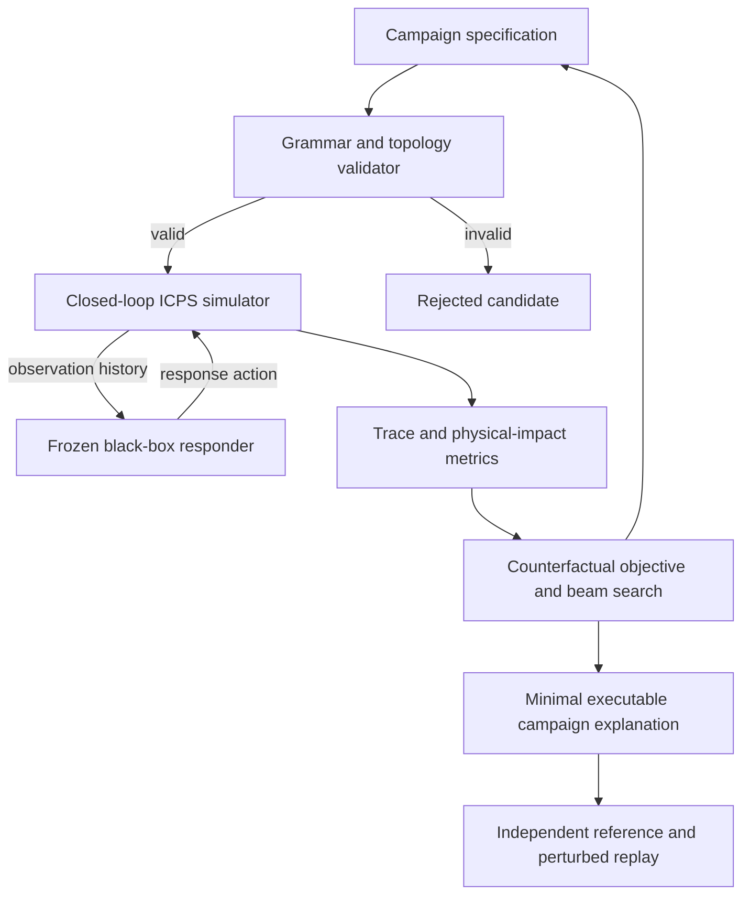

# Architecture

## Design principles

The XAI method operates on campaigns rather than arbitrary observation vectors.
Every candidate explanation is re-executed through the cyber and physical
models. The responder is frozen and queried through a narrow interface, so the
method neither depends on nor exposes its architecture.

## Data flow

## Modules

### `core/domain.py`

Typed immutable campaign events, observations, response actions, trace records,
and counterfactual results. This file defines the interfaces shared by all
components.

### `core/campaign.py`

Defines the staged campaign grammar, dependencies, allowed assets, parameter
bounds, validity checks, and local edit operators. Later C2 work can replace
the edit proposer while retaining this validity layer.

### `core/topology.py`

Defines directed conduits, acquired footholds, privilege levels, and source
requirements for each attack stage. Validation replays the campaign in time and
accepts an event only when an eligible compromised source can reach its target.

### `models/plant.py`

Implements a deterministic three-stage water-process model with optional seeded
measurement noise. The physical state is separate from the delivered sensor
state, allowing replay and bias attacks to change what the responder observes.

### `models/responder.py`

Provides a generic flat Q-learning responder. Its state uses a recurrent
evidence accumulator but contains no hierarchy, posture, action envelope, or
independent safety mechanism. `FrozenResponder` exposes only reset and act.

### `simulators/simulation.py`

Joins campaign execution, plant dynamics, observations, response actions, and
trace recording. It is the only module permitted to advance simulated time.

### `explainers/counterfactual.py`

Implements black-box beam search. Candidates are deduplicated, validated,
executed, and ranked by target decision flip, post-impact damage, edit cost,
and search depth.

### `explainers/baselines.py`

Implements direct observation-feature perturbation. `counterfactual.py` also
provides matched-budget random-valid search; cyber-only search uses the same
beam engine with its physical-impact requirement disabled.

### `evaluation/feasibility.py`

Revalidates a selected campaign independently and replays it across both
execution models and multiple seeds. It rejects non-finite values and states
outside the numerical model domain. Process-limit excursions remain measured
outcomes rather than automatic rejection.

### `evaluation/metrics.py`

Computes policy and process outcomes directly from traces and aggregates
independent runs without third-party dependencies.

### `evaluation/experiment.py`

Owns configuration, training/evaluation seed separation, artifact writing, and
generation of the LaTeX result table.

### `evaluation/protocol.py`

Owns the four-method confirmatory grid, deterministic job partitioning,
configuration hashes, atomic artifacts, policy hashes, higher-fidelity transfer,
paired bootstrap intervals, and strict aggregation of complete job sets.

## Trust boundaries

- The campaign validator is independent from the search objective.
- The plant's true state is hidden from the responder.
- The counterfactual engine may query actions but may not read the Q table.
- The final campaign is revalidated and re-executed before reporting.
- Paper tables are generated from JSON/CSV artifacts.

## Extension points

- Replace `ThreeStageWaterPlant` with an emulator adapter.
- Replace `FrozenResponder` with any callable policy.
- Add event types without changing the search contract.
- Replace beam search with an adaptive attacker in C2 while retaining campaign
  constraints and trace metrics.
