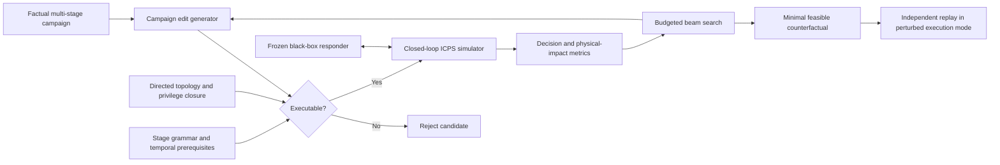

# Counterfactual Red-Teaming for Autonomous ICPS Response

[](https://github.com/ichrakhamdi/icps-counterfactual-red-teaming/actions/workflows/ci.yml)
[](https://www.python.org/)
[](LICENSE)
[](https://github.com/ichrakhamdi/icps-counterfactual-red-teaming/releases)

Campaign-level counterfactual explanations for red-teaming autonomous
threat-response agents in industrial cyber-physical systems (ICPS).

## Project presentation

This repository accompanies the six-page paper draft **“Counterfactual
Red-Teaming of Autonomous Threat-Response Agents in Industrial Cyber-Physical
Systems.”** The [LaTeX manuscript](paper/main.tex) and
[bibliography](paper/references.bib) are included. The paper is under
preparation; confirmatory results will be added only after the frozen protocol
has completed on Nibi.

The software asks one operational question:

> What is the smallest executable change to a multi-stage attack campaign that
> makes a frozen responder choose a weaker action and causes greater physical
> impact?

Feature-level counterfactuals can independently change an alarm, a network
event, and a process measurement even when that combination cannot occur.
This project instead edits the campaign that causes the observations. It checks
attack prerequisites, directed network reachability, acquired privileges,
temporal order, and closed-loop process behavior before accepting an
explanation.

## Role in the thesis

The artifact forms the transition from a fixed attack catalogue to the planned
defence-aware adversary contribution:

1. It treats the response policy as a **frozen black box** and therefore does
   not copy, modify, evaluate, or disclose the implementation or results of the
   first thesis contribution.
2. It discovers **physically executable evidence-concealment campaigns** that
   reveal where a responder can be induced to under-react.
3. Its campaign grammar, validity checker, scenario representation, and attack
   traces are reusable as an adversarial curriculum and evaluation suite for
   the second thesis contribution.

The conference artifact stops at offline diagnosis. Campaign-stage inference,
online adversarial co-training, and modification of the thesis responder belong
to the later contribution and are outside this repository.

## Main contributions

- A campaign-level counterfactual formulation for sequential autonomous
  industrial response.
- A black-box beam search over campaign target, visibility, timing, duration,
  and intensity with matched-budget baselines.
- Independent cyber and physical validation through topology replay and
  closed-loop simulation.
- A deterministic, seed-separated evaluation protocol with strict shard
  aggregation and a reproducible Nibi workflow.

## Proposed approach



The responder exposes only `reset()` and `act()`. The explainer cannot read its
Q table, gradients, hidden state, architecture, or training data. Every final
candidate is validated again and replayed in both reference and perturbed
execution modes.

## Folder architecture

```text
🗂️ icps-counterfactual-red-teaming/
├── 📁 configs/
│   ├── 📄 default.json             # Engineering pilot configuration
│   ├── 📄 smoke.json               # Fast end-to-end protocol check
│   ├── 📄 local_gate.json          # Determinism-gate configuration
│   └── 📄 cluster.json             # Frozen 30-seed confirmatory protocol
├── 📁 docs/
│   ├── 📄 CONFIGURATION.md         # Tunable values and fixed model assumptions
│   ├── 📄 EXPERIMENT_PROTOCOL.md   # Units, baselines, metrics, and statistics
│   └── 📄 CLUSTER_RUNBOOK.md       # Nibi execution and collection guide
├── 📁 jobs/nibi/
│   ├── 📄 submit.sh                # Create an isolated Slurm array run
│   ├── 📄 job.sh                   # Execute one deterministic protocol shard
│   ├── 📄 aggregate.sh             # Validate and aggregate all shards
│   └── 📄 README.md                # Cluster-specific instructions
├── 📁 paper/
│   ├── 📄 README.md                # Build and generated-table policy
│   ├── 📄 main.tex                 # Standalone IEEE conference manuscript
│   ├── 📄 references.bib           # Paper bibliography
│   └── 📁 generated/               # Ignored result tables produced by scripts
├── 📁 results/
│   └── 📄 README.md                # Local-output policy; data remain untracked
├── 📁 scripts/
│   ├── 📄 run_demo.py              # One complete counterfactual example
│   ├── 📄 run_study.py             # Multi-seed engineering study
│   ├── 📄 run_protocol_job.py      # One confirmatory shard
│   ├── 📄 run_local_protocol.py    # Complete protocol on one machine
│   ├── 📄 preflight_protocol.py    # Validate config and expected job count
│   ├── 📄 aggregate_protocol.py    # Strict aggregation and table generation
│   └── 📄 check_local.py           # Pre-release verification gate
├── 📁 src/icps_xai/
│   ├── 📁 core/                    # Campaign grammar, domain types, topology
│   ├── 📁 models/                  # Water process and frozen responder
│   ├── 📁 simulators/              # Closed-loop cyber-physical execution
│   ├── 📁 explainers/              # Proposed search and comparison methods
│   ├── 📁 evaluation/              # Feasibility, metrics, protocol, artifacts
│   └── 📄 cli.py                   # Installed command-line entry point
├── 📁 tests/                       # Unit, invariant, and integration tests
├── 📄 ARCHITECTURE.md              # Component contracts and trust boundaries
├── 📄 CITATION.cff                 # Machine-readable citation metadata
├── 📄 CONTRIBUTING.md              # Development and review procedure
├── 📄 LICENSE                      # MIT license
├── ⚙️ Makefile                     # Common reproducibility commands
└── ⚙️ pyproject.toml               # Package and Python-version metadata
```

## Installation

The reference implementation uses only the Python standard library. A virtual
environment keeps the checkout isolated:

```bash
git clone https://github.com/ichrakhamdi/icps-counterfactual-red-teaming.git
cd icps-counterfactual-red-teaming
python3 -m venv .venv
source .venv/bin/activate
python -m pip install --upgrade pip
python -m pip install -e .
```

The code supports Python 3.9, 3.11, and 3.13 in continuous integration.

## Run and test the code

### One counterfactual example

```bash
python scripts/run_demo.py
```

This trains and freezes a generic response policy, executes one factual
campaign, searches for a feasible decision-weakening campaign, and independently
replays the selected result.

### Multi-seed engineering study

```bash
python scripts/run_study.py
```

This creates JSON and CSV artifacts in `results/` and a generated LaTeX table
in `paper/generated/`. These outputs are ignored by Git.

### Fast protocol smoke test

```bash
make smoke
```

### Complete local verification

```bash
python -m unittest discover -s tests -v
make local-gate
```

The local gate compiles all Python sources, runs the invariant and integration
tests, checks Slurm syntax, repeats the local protocol to verify deterministic
content, scans the implementation boundary, and compiles the manuscript when
LaTeX is installed.

### Build the paper

```bash
make paper
```

## Confirmatory study on Nibi

Each cluster submission is isolated from other work under
`$SCRATCH/icps-counterfactual-red-teaming/runs/<RUN_ID>/`. The directory holds
separate job artifacts, Slurm logs, frozen metadata, and validated aggregates.

```bash
module load StdEnv/2023
git clone https://github.com/ichrakhamdi/icps-counterfactual-red-teaming.git
cd icps-counterfactual-red-teaming

export SLURM_ACCOUNT=def-YOUR-ALLOCATION
export CFRT_MAX_CONCURRENT=4
bash jobs/nibi/submit.sh cf-v2-$(date -u +%Y%m%dT%H%M%SZ)
```

Monitor and aggregate the run with:

```bash
squeue -u "$USER"
bash jobs/nibi/aggregate.sh RUN_ID
```

The array size is derived from `configs/cluster.json`; the frozen protocol
currently contains 30 seeds. Aggregation requires every expected shard and
rejects missing jobs, duplicates, dirty submissions, mixed configurations, and mixed commits. See
the [Nibi runbook](docs/CLUSTER_RUNBOOK.md) for collection and archival.

## Evaluation protocol

The comparison includes four methods under the same search budget:

| Method | Campaign-valid | Uses policy feedback | Optimizes physical impact |
|---|:---:|:---:|:---:|
| Feature-CF | No | Yes | No |
| Random-valid | Yes | No | No |
| Cyber-CF | Yes | Yes | No |
| Cyber-physical CF | Yes | Yes | Yes |

The primary outcomes are target validity, cyber feasibility, physical validity,
impact gain, edit cost, simulator calls, rejected campaign proposals,
wall-clock time, and transfer validity.
Training, development, and confirmatory seeds are disjoint. The full frozen
design is in [EXPERIMENT_PROTOCOL.md](docs/EXPERIMENT_PROTOCOL.md).

## Reproducibility and repository policy

- Confirmatory job files record the configuration hash, Git commit, dirty-state
  flag, policy digest, platform, Python version, and creation time.
- Aggregate JSON, CSV, LaTeX, and SHA-256 checksum files are generated from the
  complete validated run.
- Local results, trained policy tables, PDFs, LaTeX build products, private
  planning notes, credentials, virtual environments, and machine-specific files
  are excluded from version control.
- The public repository contains no unpublished result from the first thesis
  contribution.

## Cite this repository

```bibtex
@software{hamdi2026counterfactual,
  author     = {Hamdi, Ichrak},
  title      = {Counterfactual Red-Teaming for Autonomous ICPS Response},
  year       = {2026},
  version    = {0.2.1},
  url        = {https://github.com/ichrakhamdi/icps-counterfactual-red-teaming},
  license    = {MIT}
}
```

Citation metadata are also available in [CITATION.cff](CITATION.cff).

## License

This project is released under the [MIT License](LICENSE).
